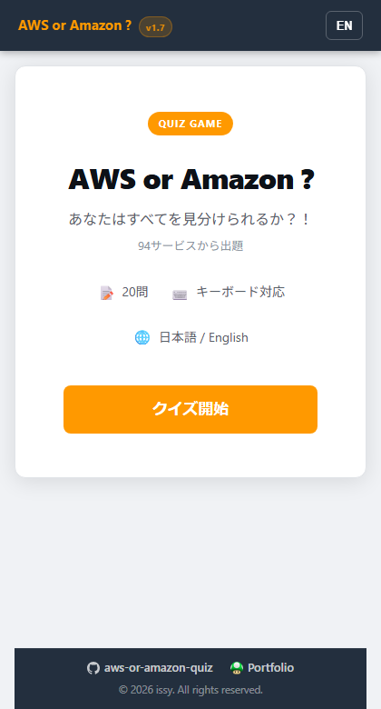
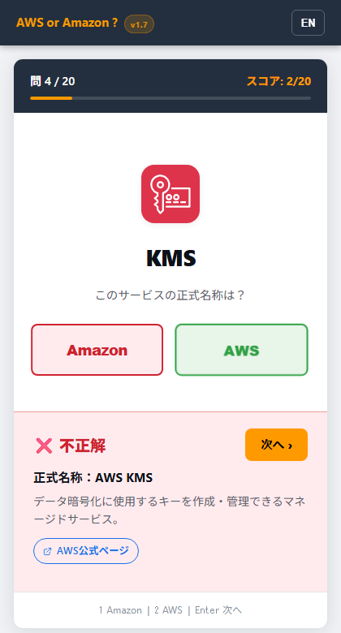
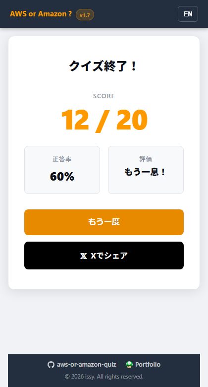

# AWS or Amazon ?

**あなたはすべてを見分けられるか？！**  
AWSサービスの正式名称プレフィックスを当てるブラウザクイズゲームです。

&nbsp;

&nbsp;

*他の言語で読む:*

---

## 🎮 ゲームの概要

AWSのサービス名には **Amazon** か **AWS** どちらかのプレフィックスがつきます。でも、どのサービスがどっちか、意外と知らないものです。

> **Amazon** Lambda？それとも **AWS** Lambda？  
> **Amazon** GuardDuty？それとも **AWS** GuardDuty？

このゲームではランダムに選ばれた20問のAWSサービスに対して正しいプレフィックスを選んでいきます。  
ログイン不要・インストール不要 — ブラウザですぐ遊べます。

---

## 📸 スクリーンショット

<table>
<tr>
<td align="center" width="33%">

**スタート画面**

</td>
<td align="center" width="33%">

**クイズ画面**

</td>
<td align="center" width="33%">

**結果画面**

</td>
</tr>
</table>

---

## 🕹️ 遊び方

1. **「クイズ開始」ボタン**を押してゲームスタート
2. 画面に表示される**サービス名**を確認（例：`Lambda`、`S3`、`GuardDuty`）
3. **「Amazon」または「AWS」**を選択 — どちらが正しいプレフィックスか？
4. **正誤をすぐ確認** — 正式名称とサービスの簡単な説明が表示されます
5. **「次へ ›」**（または **Enter** キー）で次の問題へ
6. **20問すべて答えたら**結果発表！

### ⌨️ キーボード操作

| キー | 操作 |
|---|---|
| `A` | 「Amazon」を選択 |
| `W` | 「AWS」を選択 |
| `1` / `2` | 左/右のボタンを選択（表示順は毎回ランダム） |
| `Enter` / `Space` | 次の問題へ |

---

## 🏆 評価一覧

| 正答率 | 評価 |
|---|---|
| 100% | 🟡 **完璧！！** |
| 95%以上 | 🟡 **素晴らしい！** |
| 80%以上 | 🔵 **なかなかいい！** |
| 60%以上 | ⚪ **もう一息！** |
| 60%未満 | ⚫ **まだまだこれから！** |

---

## ✨ 特徴

- **94のAWSサービス** — その中からランダムに20問を出題
- **日英バイリンガル対応** 🇯🇵🇺🇸 — ブラウザの言語設定で自動切り替え、画面右上のボタンで手動切替も可
- **解説付き** — 回答後に各サービスの概要説明を表示
- **連続正解カウンター** — 連続正解数を「🔥 N問連続正解！」で表示
- **Xへシェア** — スコアをソーシャルメディアに投稿
- **キーボード操作対応** — デスクトップでもスムーズに操作
- **ダークモード対応** — ライト／ダーク自動切り替え
- **ログイン不要・インストール不要** — ブラウザだけで動作
- **スマートフォン・PCどちらでも対応**

---

## 🚀 今すぐプレイ

> **[▶ GitHub Pages でプレイする](https://ishiharatma.github.io/aws-or-amazon-quiz/)**

インストール不要。ブラウザで開くだけで遊べます。

---

## 🛠️ 技術スタック

| | |
|---|---|
| 言語 | TypeScript（Vanilla、フレームワークなし） |
| ビルド | Vite 5 |
| ホスティング | GitHub Pages |
| CI/CD | GitHub Actions |

---

## 📄 ライセンス

MIT © [issy](https://ishiharatma.github.io/)
