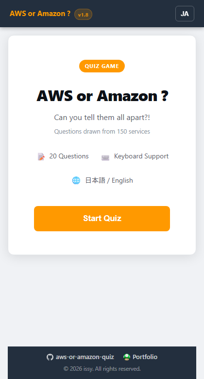
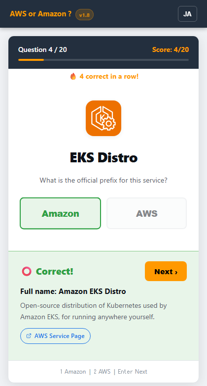
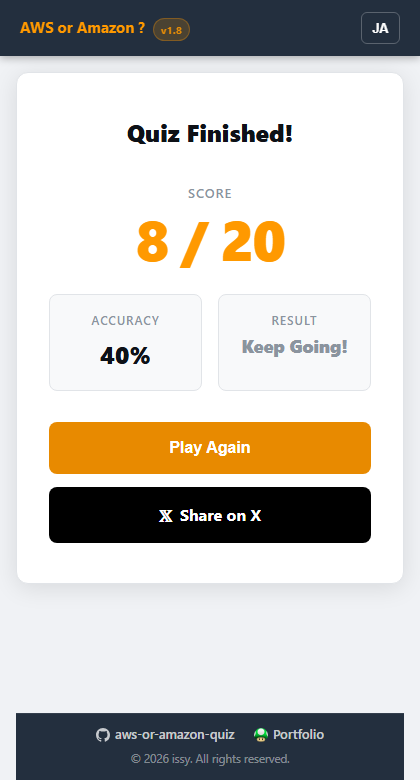

# AWS or Amazon ?

**Can you tell them all apart?!**  
A browser quiz game that tests your knowledge of official AWS service names.

&nbsp;

&nbsp;

*Read this in other languages:*

---

## 🎮 What is this?

AWS services have names that start with either **Amazon** or **AWS** — and the rule isn't always obvious.

> Is it **Amazon** Lambda or **AWS** Lambda?  
> Is it **Amazon** GuardDuty or **AWS** GuardDuty?

This quiz game challenges you to pick the correct prefix for 20 randomly selected AWS services. No login required — just open and play.

---

## 📸 Screenshots

<table>
<tr>
<td align="center" width="33%">

**Start Screen**

</td>
<td align="center" width="33%">

**Quiz Screen**

</td>
<td align="center" width="33%">

**Result Screen**

</td>
</tr>
</table>

---

## 🕹️ How to Play

1. **Press "Start Quiz"** on the start screen
2. **Look at the service name** shown (e.g., `Lambda`, `S3`, `GuardDuty`)
3. **Choose** either `Amazon` or `AWS` — which prefix is correct?
4. **See the result** instantly — you'll learn the full name and a brief description
5. **Press "Next ›"** (or hit **Enter**) to continue
6. **Finish all 20 questions** and see your score!

### ⌨️ Keyboard Shortcuts

| Key | Action |
|---|---|
| `A` | Select "Amazon" |
| `W` | Select "AWS" |
| `1` / `2` | Select the left / right button (order is randomized each question) |
| `Enter` / `Space` | Go to next question |

---

## 🏆 Score Ratings

| Accuracy | Result |
|---|---|
| 100% | 🟡 **Perfect!!** |
| 95% + | 🟡 **Excellent!** |
| 80% + | 🔵 **Well Done!** |
| 60% + | ⚪ **Almost There!** |
| < 60% | ⚫ **Keep Going!** |

---

## ✨ Features

- **150 AWS services** in the question pool — 20 randomly selected every game
- **Bilingual** — Japanese 🇯🇵 and English 🇺🇸, auto-detected from browser language
- **Service descriptions** after every answer so you actually learn
- **Streak counter** — tracks consecutive correct answers
- **Share on X** — post your score to social media
- **Keyboard navigation** for desktop users
- **Dark mode** support
- **No login, no tracking** (except anonymous Google Analytics)
- Works on **mobile and desktop**

---

## 🚀 Play Online

> **[▶ Play now on GitHub Pages](https://ishiharatma.github.io/aws-or-amazon-quiz/)**

No installation needed — just click and play in your browser.

---

## 🛠️ Tech Stack

| | |
|---|---|
| Language | TypeScript (Vanilla, no framework) |
| Build | Vite 5 |
| Hosting | GitHub Pages |
| CI/CD | GitHub Actions |

---

## 📄 License

MIT © [issy](https://ishiharatma.github.io/)
